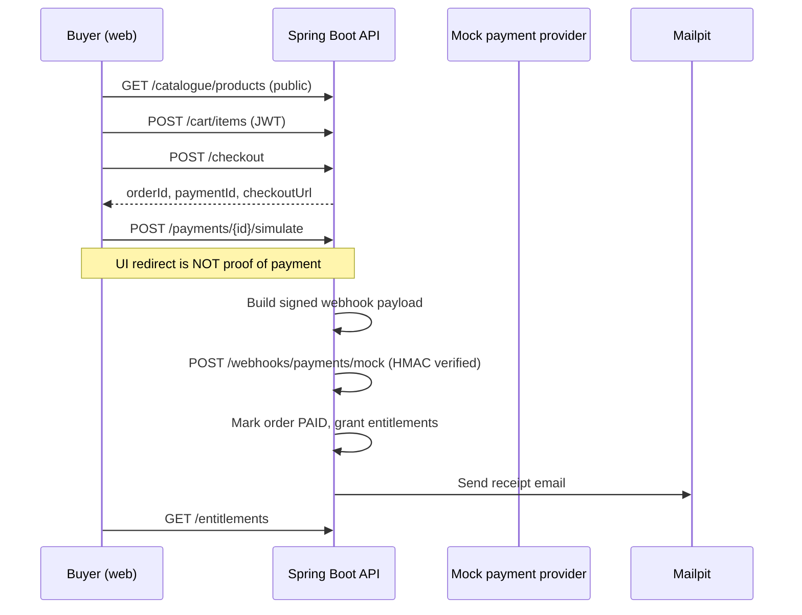

# Commerce Flow (Phase 3)

Phase 3 implements the purchase loop from catalogue browse through verified payment to entitlement grant.

## Purchase sequence

## Security rules

- **Entitlements are never granted from the checkout redirect or simulate endpoint alone.**
- The mock provider delivers a server-to-server webhook with HMAC-SHA256 signature.
- Webhook processing is idempotent via `payment_webhook_events.idempotency_key`.
- Amount and payment reference are validated before grant.

## API endpoints

| Method | Path | Auth | Purpose |
|--------|------|------|---------|
| `GET` | `/api/v1/catalogue/products` | Public | List published products |
| `GET` | `/api/v1/catalogue/products/{id}` | Public | Product detail |
| `GET/POST/PUT/DELETE` | `/api/v1/cart` | JWT | Cart management |
| `POST` | `/api/v1/checkout` | JWT | Create order + payment |
| `POST` | `/api/v1/payments/{id}/simulate` | JWT | Trigger mock webhook |
| `POST` | `/api/v1/webhooks/payments/mock` | HMAC | Payment confirmation |
| `GET` | `/api/v1/orders` | JWT | Buyer order history |
| `GET` | `/api/v1/entitlements` | JWT | Active entitlements |

## Local setup

- **Mailpit** — receipt emails at http://localhost:8025
- **Keycloak** — buyer sign-in for cart/checkout
- Set `PAYMENT_WEBHOOK_SECRET` in API env (defaults to dev secret in `application.yml`)

Free products (`price_cents = 0`) skip the payment UI and grant entitlements immediately via the same webhook pipeline.
