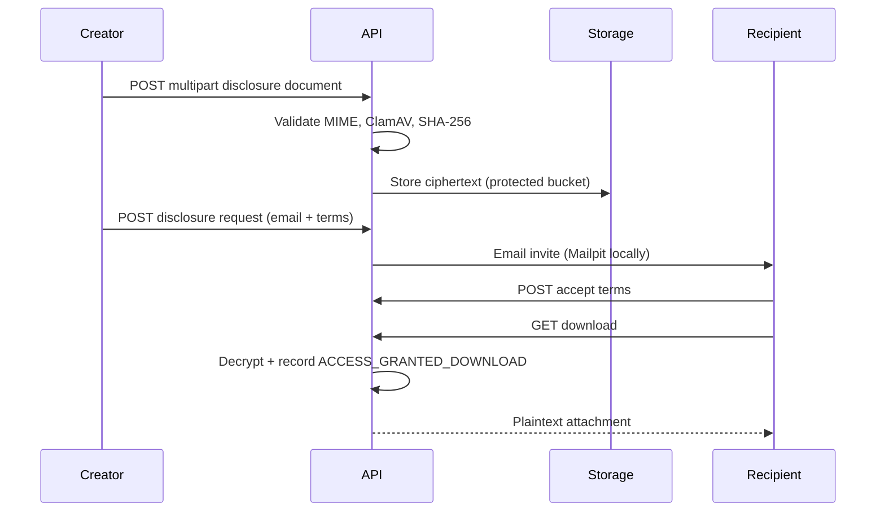

# Confidential Disclosure (Phase 7)

Phase 7 adds controlled disclosure of encrypted documents with hash evidence, explicit term acceptance, and an access event trail.

## What it is

Creators can:

1. Upload a confidential document (quarantine → MIME check → ClamAV → envelope encrypt)
2. Persist the plaintext SHA-256 checksum as evidence of existence
3. Invite a recipient (must already have a CipherMarket account)
4. Attach confidentiality terms and an optional expiration
5. Revoke future access

Recipients can:

1. Review terms in the buyer portal disclosures inbox
2. Accept or reject
3. Download only after acceptance while the request remains valid

## What it is not

- Hashing does **not** create copyright or patent protection
- Acceptance does **not** automatically create a legally binding NDA
- Creators remain responsible for legal review of their terms

## Sequence

## API

| Method | Path | Role |
|--------|------|------|
| POST | `/api/v1/organisations/{orgId}/disclosures/documents` | Product manager+ |
| GET | `/api/v1/organisations/{orgId}/disclosures/documents` | Org member |
| POST | `/api/v1/organisations/{orgId}/disclosures/documents/{id}/requests` | Product manager+ |
| GET | `/api/v1/organisations/{orgId}/disclosures/requests` | Org member |
| POST | `/api/v1/organisations/{orgId}/disclosures/requests/{id}/revoke` | Product manager+ |
| GET | `/api/v1/disclosures/inbox` | Recipient |
| POST | `/api/v1/disclosures/inbox/{id}/accept` | Recipient |
| POST | `/api/v1/disclosures/inbox/{id}/reject` | Recipient |
| GET | `/api/v1/disclosures/inbox/{id}/download` | Recipient (accepted) |

Encryption AAD is `organisationId:documentId:v{version}`. Audit and security events are recorded for upload, request, accept, revoke, and download.
