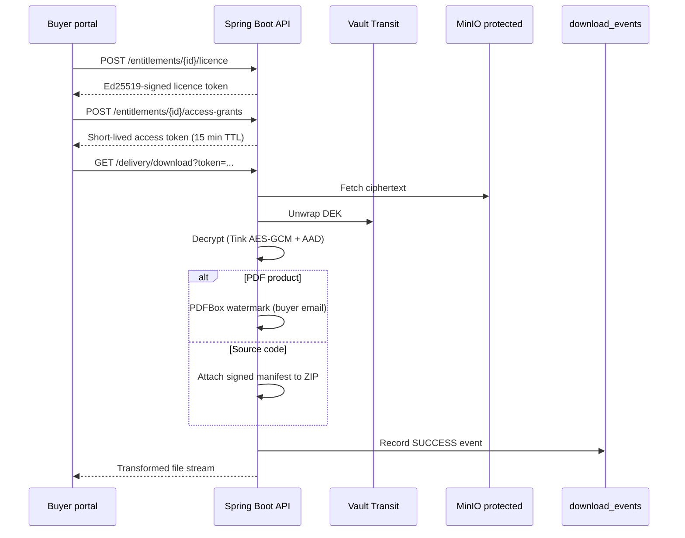

# Secure Delivery Sequence (Phase 4)

Phase 4 connects purchase entitlements to encrypted asset delivery with buyer-specific transforms and short-lived access grants.

## Flow



## Security controls

- **Licence tokens** — Ed25519-signed JSON claims bound to entitlement, buyer, and product version.
- **Access grants** — Opaque tokens with SHA-256 hash storage, TTL, and max-use limits.
- **No direct storage URLs** — Downloads always pass through the API decrypt-and-transform pipeline.
- **AAD binding** — Decryption uses `productId:productVersionId:assetId` associated data from upload.
- **Audit trail** — Every delivery attempt recorded in `download_events`.
- **Device registration** — Optional device binding before grant issuance (`ciphermarket.delivery.require-device-registration`).

## API endpoints

| Method | Path | Auth | Purpose |
|--------|------|------|---------|
| `POST` | `/api/v1/entitlements/{id}/licence` | JWT | Issue/retrieve Ed25519 licence |
| `POST` | `/api/v1/entitlements/{id}/access-grants` | JWT | Create short-lived download grant |
| `GET` | `/api/v1/delivery/download?token=` | Grant token | Stream decrypted product |
| `POST/GET/DELETE` | `/api/v1/devices` | JWT | Register/list/revoke devices |
| `GET` | `/api/v1/downloads/history` | JWT | Buyer download audit log |

## Configuration

```yaml
ciphermarket:
  delivery:
    grant-ttl-minutes: 15
    max-uses-per-grant: 3
    licence-validity-days: 365
    require-device-registration: false
  licence:
    signing-private-key-base64: # Ed25519 PKCS8, required in production
    signing-public-key-base64:
```

If signing keys are omitted, an ephemeral Ed25519 key pair is generated at startup (development only).
