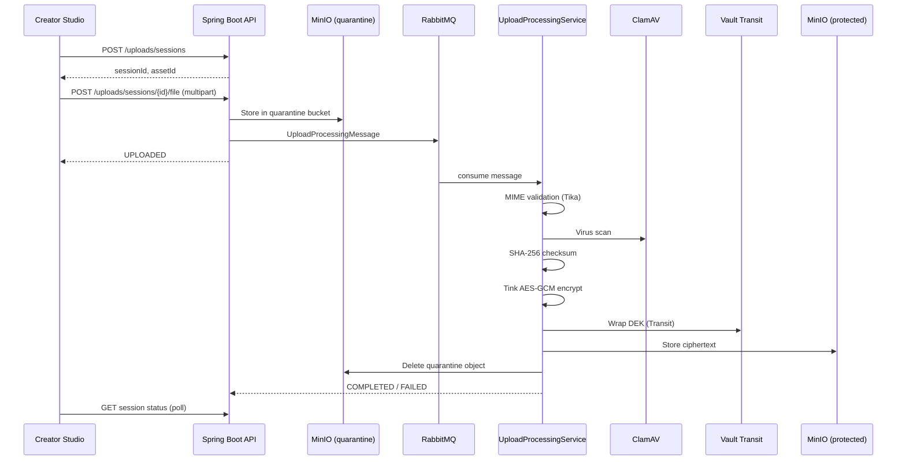

# Secure Upload Sequence

Phase 2 implements a zero-trust upload pipeline for creator assets. Files never enter protected storage in plaintext.

## Flow

## States

| Stage | Upload session | Product version |
|-------|----------------|-----------------|
| Session created | `INITIATED` | `DRAFT` |
| File uploading | `UPLOADING` | `UPLOADING` |
| Queued for worker | `UPLOADED` | — |
| Worker running | `PROCESSING` | `SCANNING` / `PROCESSING` |
| Success | `COMPLETED` | `DRAFT` (ready to publish) |
| Failure | `FAILED` | unchanged |

## Security controls

- **Quarantine isolation** — Raw uploads land in a separate bucket with no public access.
- **MIME validation** — Apache Tika verifies content type against declared type.
- **Malware scanning** — ClamAV scan before encryption (skipped gracefully if ClamAV is unavailable in dev).
- **Envelope encryption** — Per-file DEK encrypted with Tink AES-GCM; DEK wrapped via Vault Transit.
- **Tenant isolation** — All operations scoped to organisation membership and RBAC.
- **Audit trail** — Product and upload lifecycle events recorded in the hash-chained audit log.

## Local requirements

Upload processing requires Docker Compose services:

- MinIO (quarantine + protected buckets)
- RabbitMQ (upload processing queue)
- Vault (Transit key wrapping)
- ClamAV (optional but recommended)

Start infrastructure with `docker compose up -d` from the repo root, then run the API.

## API endpoints

| Method | Path | Purpose |
|--------|------|---------|
| `POST` | `/api/v1/organisations/{orgId}/products/{productId}/uploads/sessions` | Create session |
| `POST` | `.../sessions/{sessionId}/file` | Upload to quarantine |
| `GET` | `.../sessions/{sessionId}` | Poll processing status |

All endpoints require a valid Keycloak JWT with creator organisation membership.
