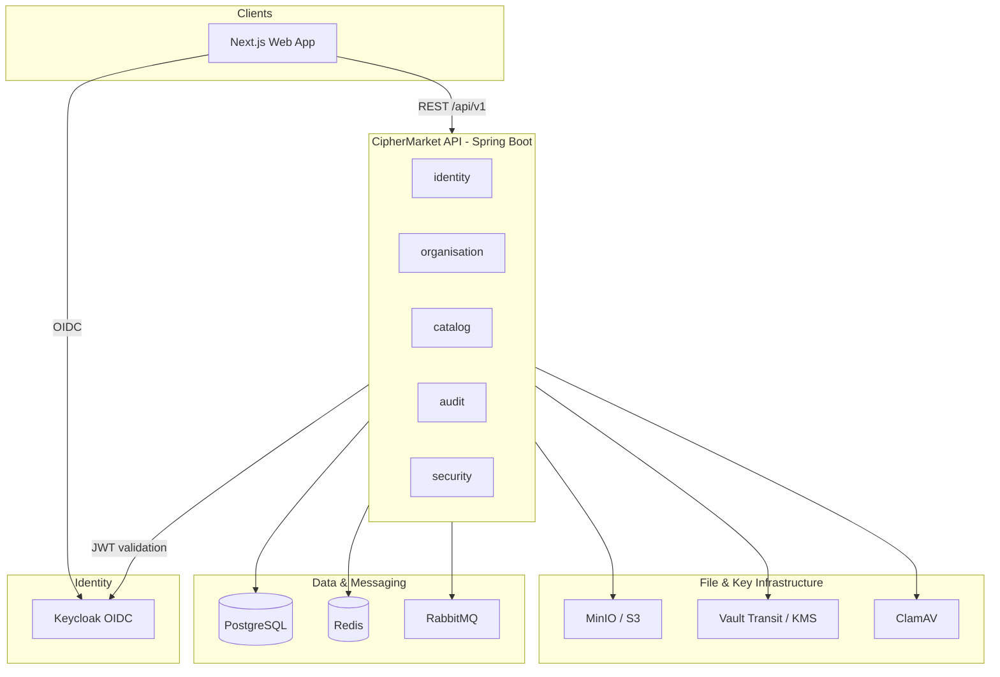
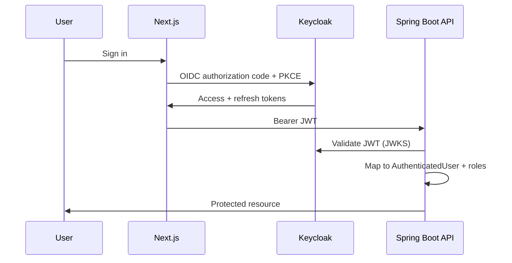

# System Architecture

CipherMarket is implemented as a **modular monolith** with clear boundaries so individual modules can become independent services later.

## High-level diagram

## Module boundaries (Phase 1)

| Package | Responsibility |
|---------|----------------|
| `identity` | User profile provisioning from Keycloak claims |
| `organisation` | Tenants, memberships, RBAC enforcement |
| `catalog` | Categories (products in Phase 2) |
| `audit` | Append-only tamper-evident audit trail |
| `security` | JWT conversion, Spring Security config |
| `common` | Shared enums, exceptions, correlation IDs |
| `health` | Custom health indicators |

Future modules (planned):

- `upload` — quarantine pipeline, MIME validation, ClamAV
- `encryption` — envelope encryption via `EncryptionProvider`
- `commerce` — orders, payments, webhooks
- `entitlement` — licences, access grants, downloads
- `disclosure` — confidential document workflow
- `securityops` — security events, risk engine

## Tenant isolation

Every tenant-owned resource includes an `organisation_id`. Application services:

1. Resolve the authenticated user’s profile
2. Verify active organisation membership
3. Never trust client-supplied organisation IDs without membership check
4. Set `TenantContext` for downstream operations where applicable

## Authentication flow

## Audit trail

Audit events are:

- Append-only (PostgreSQL trigger prevents UPDATE/DELETE)
- Hash-chained (`event_hash` includes `previous_hash`)
- Correlated via `X-Correlation-Id` request header

## Deployment model (future)

Phase 6 targets containerised deployment with:

- Non-root Docker images
- External managed PostgreSQL, Redis, RabbitMQ
- Production Vault or cloud KMS
- Prometheus + Grafana (`docker compose --profile monitoring`)
