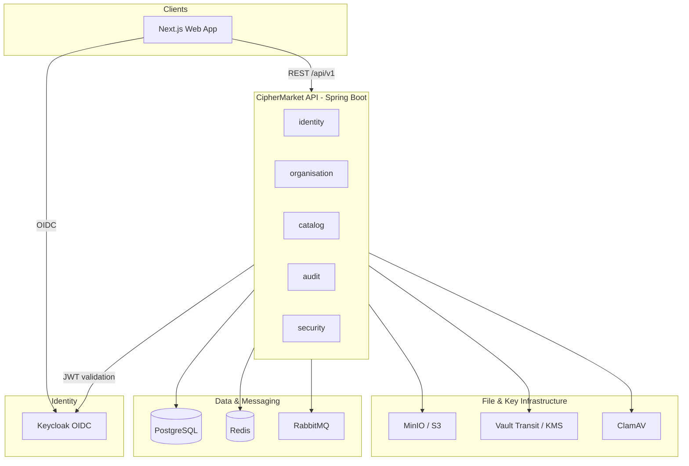
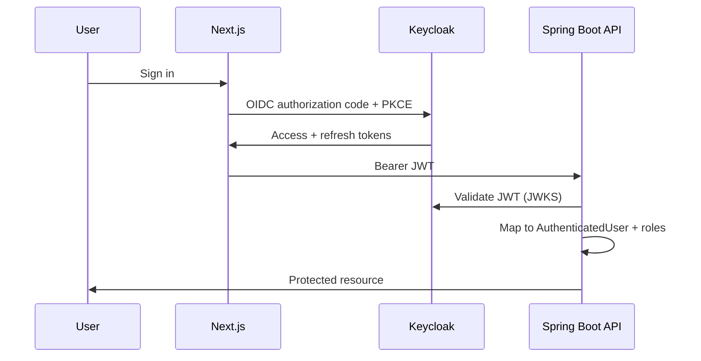

# System Architecture

CipherMarket is implemented as a **modular monolith** with clear boundaries so individual modules can become independent services later.

## High-level diagram

## Module boundaries

| Package | Responsibility |
|---------|----------------|
| `identity` | User profile provisioning from Keycloak claims |
| `organisation` | Tenants, memberships, RBAC enforcement |
| `catalog` / `product` | Categories, products, versions, publishing |
| `upload` | Quarantine pipeline, MIME validation, ClamAV |
| `encryption` | Envelope encryption via `EncryptionProvider` |
| `commerce` | Catalogue, cart, checkout, signed payment webhooks |
| `delivery` | Licences, access grants, decrypt-and-transform downloads |
| `audit` | Append-only tamper-evident audit trail |
| `securityops` | Security events, sealed batches, maker-checker |
| `security` | JWT conversion, headers, rate limiting |
| `common` | Shared enums, exceptions, correlation IDs |
| `health` | Custom health indicators |

## Tenant isolation

Every tenant-owned resource includes an `organisation_id`. Application services:

1. Resolve the authenticated user’s profile
2. Verify active organisation membership
3. Never trust client-supplied organisation IDs without membership check
4. Set `TenantContext` for downstream operations where applicable

## Authentication flow

## Audit trail

Audit events are:

- Append-only (PostgreSQL trigger prevents UPDATE/DELETE)
- Hash-chained (`event_hash` includes `previous_hash`)
- Correlated via `X-Correlation-Id` request header

## Deployment model

Containerised deployment uses non-root images and a production Spring profile:

- API image: `services/api/Dockerfile`
- Web image: `apps/web/Dockerfile` (standalone Next.js)
- Overlay: `docker compose -f docker-compose.yml -f docker-compose.prod.yml up -d --build`
- External managed PostgreSQL, Redis, RabbitMQ, and production Vault or cloud KMS in real environments
- Prometheus + Grafana (`docker compose --profile monitoring`)
- Details: [Production readiness](../operations/production-readiness.md)
