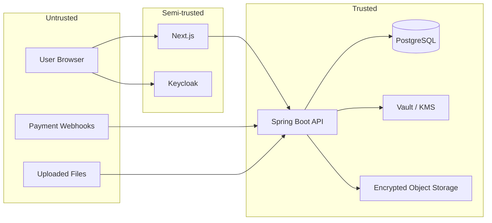

# Threat Model (Initial — Phase 1)

This document identifies assets, actors, trust boundaries, attack surfaces, mitigations, and residual risks for CipherMarket at foundation stage.

## Assets

| Asset | Sensitivity |
|-------|-------------|
| Product files (encrypted) | Critical |
| Data encryption keys (wrapped) | Critical |
| Payment and order records | Critical |
| Audit and security logs | High |
| User PII (email, profile) | High |
| Licence tokens (Ed25519, Phase 4) | High |
| Organisation membership data | Medium |

## Actors

| Actor | Intent |
|-------|--------|
| Buyer | Legitimate purchase and access |
| Creator | Publish and manage products |
| Marketplace admin | Platform governance |
| Security auditor | Read-only investigation |
| Support officer | Limited order support |
| External attacker | Theft, fraud, disruption |
| Malicious insider | Abuse elevated privileges |
| Compromised account | Lateral movement |

## Trust boundaries

## Attack surfaces (Phase 1)

| Surface | Abuse case | Mitigation (current/planned) |
|---------|------------|------------------------------|
| OIDC login | Credential stuffing | Keycloak brute-force protection |
| REST API | IDOR, cross-tenant access | Membership verification, tenant isolation tests |
| JWT | Token theft, replay | Short-lived tokens, HTTPS, refresh rotation (Keycloak) |
| Audit log | Tampering | Append-only table, hash chaining |
| Docker dev secrets | Credential leak | `.env.example` only, no secrets in images |
| CORS | Cross-origin abuse | Explicit allowed origins |

## Planned attack surfaces (Phases 2–5)

| Surface | Abuse case | Planned mitigation |
|---------|------------|-------------------|
| File upload | Malware, ZIP bombs, path traversal | Quarantine, ClamAV, signature validation |
| Payment webhooks | Forgery, replay | Signature verification, idempotency, timestamp checks |
| Download URLs | URL sharing | Short-lived access grants, no permanent URLs |
| PDF delivery | Screenshot/copy | Watermarking, documented limitations |
| Admin actions | Privilege abuse | Maker-checker, audit, least privilege |

## Mitigations implemented (Phase 1)

- Keycloak OIDC instead of custom auth
- Spring Security resource server with role-based URL rules
- Organisation membership checks before tenant data access
- Append-only audit events with SHA-256 hash chain
- RFC 7807 problem responses with correlation IDs
- Structured logging with correlation ID in MDC
- Input validation (Bean Validation on DTOs)
- Flyway migrations (no Hibernate DDL in production)

## Residual risks

| Risk | Severity | Notes |
|------|----------|-------|
| Readable content can be copied | High | Accepted; mitigated by tracing not prevention |
| Vault dev mode in local env | Medium | Documented; must not reach production |
| Keycloak misconfiguration | High | Requires operational hardening in deployment |
| Insider with OWNER role | Medium | Audit trail; maker-checker in Phase 5 |
| Browser PDF controls bypass | Medium | Honest documentation required |
| DDoS / rate limiting | Medium | Rate limiting planned for API gateway Phase 6 |

## Review schedule

Revisit this threat model at the start of each implementation phase and after any material architecture change.
